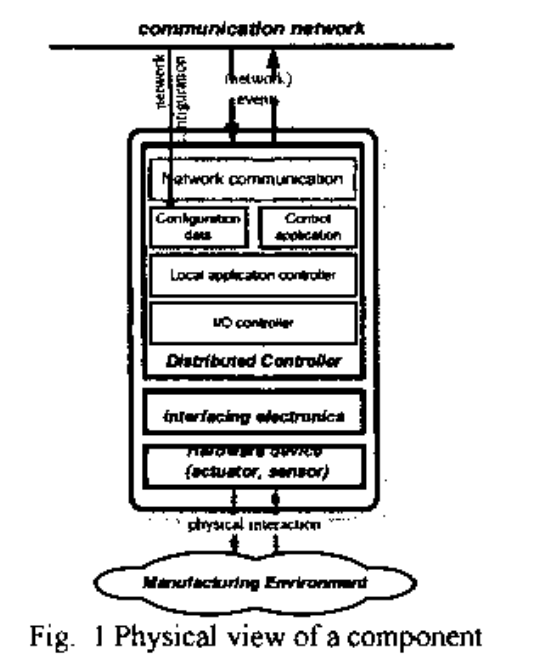
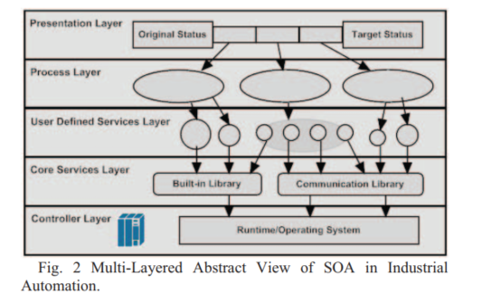
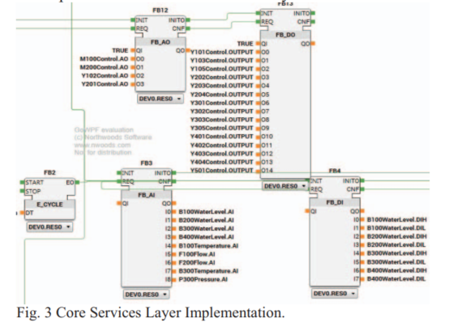
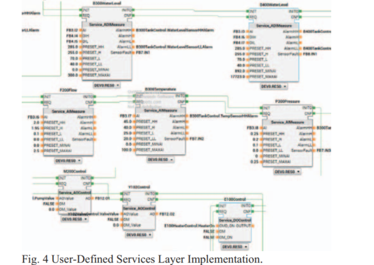
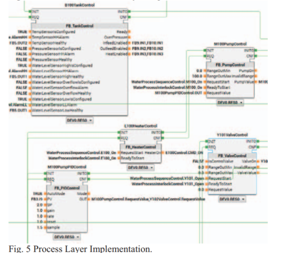
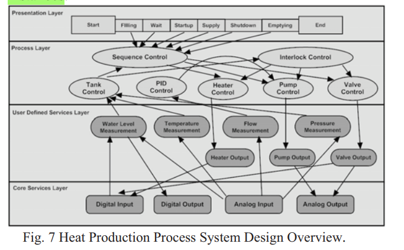

#  Paradigmas de Programação em Sistemas Industriais

## 🥸 Proposta TCC:

### 🦅 Introdução
A crescente complexidade dos sistemas de automação industrial exige respostas rápidas e eficientes às mudanças contínuas no ambiente industrial. Historicamente, a lógica de controle em sistemas de automação era implementada por meio de circuitos elétricos, utilizando combinações de relés, temporizadores de came, sequenciadores de tambor e controladores de malha fechada dedicados. Esse método era extremamente complexo e demorado, e a verificação da correção da lógica de controle só podia ser realizada testando com sistemas reais.

Com o advento dos controladores lógicos programáveis (CLPs) nas décadas seguintes, a programação evoluiu significativamente. Nos primeiros CLPs, os programas eram escritos em linguagens proprietárias. Nos anos 1990, foi introduzida a lógica ladder, que se assemelha a um diagrama esquemático da lógica de relé física, facilitando o desenvolvimento de programas de automação de uso geral. Em 1993, foi publicada a primeira edição do padrão internacional para CLPs, IEC 61131-3, que definiu cinco linguagens de programação: lógica ladder (LD), texto estruturado (ST), lista de instruções (IL), diagrama de blocos funcionais (FBD) e a linguagem baseada em máquina de estados, Sequential Function Chart (SFC). Esse padrão também introduziu as unidades organizacionais de programação (POUs) – funções e blocos funcionais – que permitiram encapsular a lógica de controle e reutilizá-la em projetos futuros, melhorando significativamente a eficiência do design e desenvolvimento de software para CLPs.

No entanto, o tamanho físico e as funcionalidades das plantas de manufatura continuam a crescer, e o poder de processamento dos CLPs não consegue acompanhar essas demandas. Controlar esses sistemas complexos com um CLP centralizado muitas vezes não é viável. Para abordar as limitações da arquitetura do padrão IEC 61131-3, foi publicado em 2005 e revisado em 2012 o padrão IEC 61499, que auxilia no desenvolvimento de sistemas de automação distribuída.

Nesse contexto, a programação orientada a objetos (OOP), introduzida na última edição da IEC 61131-3, visa aumentar a modularidade e a reutilização do código em sistemas de automação industrial. O OOP permite que a lógica de controle seja encapsulada em objetos, que são instâncias de classes que combinam dados e métodos. Essa abordagem facilita a manutenção e a escalabilidade dos sistemas, pois os objetos podem ser reutilizados e modificados independentemente. A motivação para o uso de OOP reside na necessidade de gerenciar a complexidade crescente dos sistemas de automação, proporcionando uma maneira estruturada e organizada de desenvolver software que pode ser facilmente entendido, mantido e expandido.

O design baseado em componentes (CBD), promovido pelo padrão IEC 61499, oferece uma abordagem mais distribuída para o desenvolvimento de sistemas de automação. No CBD, a lógica de controle é dividida em blocos funcionais, que são componentes de software reutilizáveis e independentes. Cada bloco funcional pode ser configurado e combinado com outros para formar sistemas completos. Essa abordagem permite maior flexibilidade e escalabilidade, pois os componentes podem ser desenvolvidos, testados e implantados de forma independente. A motivação para o uso do CBD é a necessidade de criar sistemas de automação que possam ser rapidamente adaptados às mudanças nas condições de manufatura, bem como a capacidade de distribuir a lógica de controle por várias unidades de processamento para melhorar o desempenho e a confiabilidade.

Na Arquitetura Orientada a Serviços (SOA), a lógica de controle é organizada em serviços, que são unidades de software fracamente acopladas que interagem através de interfaces bem definidas. Esses serviços podem ser distribuídos em diferentes dispositivos e plataformas, proporcionando alta flexibilidade e interoperabilidade. A principal motivação para o uso da SOA é a necessidade de integrar a descrição do processo de automação na lógica de controle, permitindo uma melhor compreensão do sistema como um todo e aumentando a produtividade dos designers. Além disso, a SOA facilita a colaboração entre diferentes sistemas e organizações, promovendo uma abordagem mais ágil e adaptável para a automação industrial.

### ✅ Objetivos

### 🧐Metodologia

## 📚📚 Orientado a objeto:

### Fundamentação Teórica🤓:

No paradigma de programação orientada a objeto, o principal elemento é o próprio objeto, o qual vai encapsular dados e métodos para o processamento desses dados.

No contexto de automação industrial, esses objetos de software estão normalmente relacionados aos objetos físicos, conhecidos como dispositivos, como, por exemplo, transportadoras, sensores e maquinários.

Esses dispositivos são contolados por sinais de controle que podem ser gerados diretamente pelos objetos de software associados a ele ou através de uma cadeia de invocação mais complexa por outros objetos de sofware.

Um bom exemplo seria em um sistema de gerenciamento de bagagens em um aeroporto, em que uma transportadora pode ser acionada por um sinal de 'requisição de partida' enviado por uma transportadora acima, quando começa a se mover.

O uso de OOP visa no aumento da reutilização de código. Os softwares de automação poderiam ser construídos a partir de uma biblioteca de classes de dispositivos.

O sistema poderia ser facilmente extendido com a inserção de mais instâncias de objetos. Se alguma funcionalidade de um maquinário precisasse de alguma mudança ou um novo tipo de máquina foi inserida na planta, as classes de dispositivos poderiam ser ajustadas facilmente para atender aos novos requisitos ao usar a herança e polimorfismo, conceitos da OOP.

### 💻Estudo de caso

## 📚📚 Orientado a serviço:

### Fundamentação Teórica🤓:

A arquitetura baseada em serviço é um conjunto de componentes de software que a descrição da interface pode ser publicada e descoberta.

Provedores e consumidores de serviço são fracamente acoplados para assegurar a mínima dependência entre os serviços. A interação entre os serviços é definida em um contrato de serviço, o qual pode ser publicado para um repositório de serviço.

Para assegurar pouca acoplagem nos programas IEC 61499, os blocos de função devem encapsular a maior parte da funcionalidade dos serviços, necessitando do mínimo de dados externos.

Por exemplo, num gerenciamento de bagagem em um aeroporto, os serviços são o controle da transportadora, a parada de emergência e o procedimento de check-in.

Nesse caso, os sinais que precisam ser enviados são mínimos. Para o serviço de parada de emergência, somente o status de zona de parada de emergência é necessário para o serviço de controle da transportadora. Já o procedimento de check-in vai somente informar o serviço de controle da transportadora quando uma nova mala introduzida no sistema de gerenciamento de bagagem.

### 💻Estudo de caso

O estudo de caso usa um sistema de produção de calor (HPP) como mostrado na figura abaixo.

- Processo:
    1. Água fria entra para o tanque de água de reposição (B400);

    2. A água do tanque de reposição vai alimentar o tanque de pré aquecimento (B100) pela válvula de controle Y101 quando o nível da água do tanque de pré aquecimento estiver baixa;

        - Existe um aquecedor no tanque de pré aquecimento, o qual vai esquentar a água até perto do ponto de ebulição.

    3. Água quente vai ser bombeada para o tanque de alimentação (B200) utilizando a válvula de controle Y102 e uma bomba M100;

    4. Quando a caldeira (B300) estiver pronta, a água do tanque de alimentação será bombeada para a caldeira através da válvula Y201 e da bomba M200;

        - Tem um indicador de pressão e um sensor de temperatura na caldeira para evitar sobre aquecimento e sobre pressão;

        - Quando qualquer emergência acontecer, a válvula Y204 é aberta para diminuir a pressão e a temperatura na caldeira;

        - Em cada tanque, há um conjunto de indicadores de nível alto (Lx01 - Analógico, Lx00 - Digital) e baixo (Lx02 - Analógico) para medir o nível e detectar condições anormais
    
    5. A água pressurizada no tanque da caldeira será fornecida ao cliente através da válvula de abastecimento Y305. Por fim, a água pode ser descarregada abrindo a válvula Y105

No domínio da computação, SOA é apresentado em uma arquitetura em camadas de serviços compostos. Um conceito parecido pode ser ser aplicado no domínio da automação industrial.

 

A camada inferior é a camada de controle, que consiste do sistema operacional e do ambiente de execução para os controladores.

Acima da camada de controle, serviços, incluindo *bult-in functions* e *handlers de comunicação* (para troca de mensagens externas e acesso ao fieldbus em CLPs), são definidos na camada de serviços principais.

A próxima camada é a camada de serviços definidos pelo usuário. Funções ou blocos de funções desenvolvidas nessa camada podem atuar como consumidores de serviços,invocando serviços dos provedores da camada de serviços principais.

A segunda camada do topo é a camada do processo, que contém informações dos processos físicos individuais controlados por funções de automação, como enchimento de água.

A camada superior é a camada de apresentação, que forma os processos individuais em um sistema completo, usando diagramas de sequência e *flowcharts*. Essa camada possui conhecimento do sistema de automação inteiro.

#### ➡️ Camadas

Primeiramente, o projeto dos blocos de função da camada de serviços é apresentado. As bibliotecas *built ins*, comunicação com FB em controladores externos e o acesso ao *fieldbus* são normalmente implementados em Blocos de Função de Interface de Serviço (SIFB), que são blocos de função que fornecem interfaces para serviços específicos em sistemas de automação industrial.

Neste caso, funções integradas como o evento cíclico FB (E_CYCLE), FB inversor (NOT), e acesso de E/S a fieldbus - Entradas Analógicas e Saídas Analógicas (FB_AI, FB_AO) e Entradas Digitais e Saídas Digitais (FB_DI, FB_DO) são implementadas na camada de serviços principais.

Já a camada de serviços definidos por usuários para o sistema HPP possui quatro tipos de serviços: medição de sensor analógico (Service_AIMeasure), controle de atuador analógico (Service_AOControl), medição de sensor digital (Service_DIMeasure) e o controle de atuador digital (Service_DOControl).

Os blocos de função de medição analógico e digital fazem leituras de proximidade de nível de água  (Lx00, Lx01 e Lx02), sensores de temperatura (Tx00), sensores de pressão (Px00) e sensores de medição de fluxo (Fx00), e geram alarmes para cada variável do processo. Existem cinco tipos de alarmes gerados para cada sensor: HH, H, L, LL e F, que se referem a Alarme Alto, Aviso Alto, Aviso Baixo, Alarme Baixo e Falha, respectivamente.

Cada bloco de função de serviço de atuador recebe duas entradas: uma do nível superior (modo automático) e uma da Interface Homem-Máquina (HMI, modo manual).

Na camada de processo, os serviços são agrupados por funcionalidades dentro do processo, controle de tanque (FB_TankControl), controle PID (FB_PIDControl), controle de aquecedor (FB_HeaterControl), controle de bomba (FB_PumpControl) e controle de válvula (FB_ValveControl).

O serviço de controle do tanque coleta sinais de alarme dos serviços de medição de sensores e gera status para o tanque, como se o tanque está pronto para entrada e saída de água, se o tanque pode ser aquecido e se o tanque está sobre pressurizado.

O serviço de controle do PID lê os valores de medidas do serviço de medição de vazão e recalcula o valor de controle para os serviços de controle da válvula e bomba.

Os serviços de controle do aquecedor, bomba e válvula checam que o valor de controle está dentro do range e produzem comandos de saída para os serviços de controle dos atuadores.

Na camada superior, dois serviços são definidos: serviço de controle de sequência e serviço de intertravamento.

O serviço de controle de sequência controla todas as válvulas, aquecedoes e bombas baseado no *feedback* coletado dos serviços de controle de tanque na camada de processo.

A sequência HPP é definida em cinco passos: Enchimento, Espera, Inicialização, Desligamento e Esvaziamento.

Finalmente, tem-se a visão geral da configuração do sistema HPP.

Uma instância individual é criada para cada objeto devido à limitação do padrão IEC 61499: não há memória compartilhada, portanto, os dados não podem ser armazenados globalmente; cada entrada de dados só pode ser conectada a uma saída de dados, de modo que um serviço não pode ser compartilhado por múltiplas instâncias.

### Discussão 👀👀

O objetivo ao adotar o paradigma orientado a serviço é para promover uma melhor reusabilidade e flexibilidade, bem como melhorar a eficiência e produtividade no desenvolvimento de software.

No estudo desse artigo, vê-se uma abordagem com várias camadas sendo proposta. Nessa abordagem, os serviços da camada superior acionam os serviços da camada inferior acionam os serviços da camada inferior enviando sinais de solicitação e coletam os dados de resposta dos serviços da camada inferior.

A camada de apresentação na abordagem SOA fornece uma visão semântica das configurações do sistema. Em vez de apenas ilustrar as conexões entre unidades de software como na POO e no CBD, a abordagem baseada em SOA descreve a solução de automação como uma sequência, que especifica as ações que o sistema realizará em um estado de processo específico.

A camada de serviços definidos pelo usuário são funções reutilizáveis desenvolvidas nesta configuração de sistema, que podem ser utilizadas no futuro. Esses serviços fornecem uma camada abstrata para os serviços principais e uma ponte entre processos e funções básicas.

A camada de processo compõe funcionalidades básicas a partir de serviços definidos pelo usuário e serviços principais para formar sequências simples.

Finalmente, a camada de apresentação é o 'cérebro' do sistema de controle. 

Aplicar o paradigma SOA pode trazer benefícios substanciais para o design de software na automação industrial. Os sistemas baseados em SOA são fáceis de estender, modificar e depurar. Não há necessidade de encapsulação de blocos de função como em componentes de componentes no CBD. Na visão SOA, a encapsulação é realizada usando coreografia de serviços, que define a visão global da interação de serviços. Diferentemente do conceito de ocultação de complexidade no design baseado em componentes, o SOA fornece uma estrutura "plana", que é conveniente para identificar o bloco de função alvo para modificação durante o processo de depuração.

## 📚📚 Baseado em componente:

### Fundamentação Teórica🤓:

A abordagem baseada em componente não está  interessada com as técnicas de derivação dos componentes a partir de outros componentes, mas está focada nas metodologias de criação, composição e execução dos componentes.

A norma IEC 61499 se encaixa perfeitamente no conceito de design baseado em componente, com um bloco de função modelando um componente. Esses blocos são conectados entre si por interfaces predefinidas (conexão de eventos e dados).

Um componente pode ser composto por outros componentes, o que possibilita a modelagem de estruturas hierárquicas que ajudam na reutilização do projeto de subsistemas inteiros, como o subsistema de triagem que consiste em máquinas de raio-x e leitores automáticos de etiquetas.

### 💻Estudo de caso

## 💡Características 

Como é possível perceber, esses paradigmas foram todos inventados com o objetivo de melhorar a reusabilidade e a eficiência de um programa ao introduzir a reusabilidade de unidades de software.

Para aplicar esses conceitos e melhorias, todos esses paradigmas de programação fornecem conceitos de encapsulamento para elementos de biblioteca.

SOA possui a melhor flexibilidade geral devido à interface configurável definida por um contrato de serviço separado entre as unidades de software.

|    |OOP|CBD|SOA|
|---------|----|-----|-----|
|**Unidade de Software**| Classes(Objetos)| Componente de Software| Serviço de Software|
|**Características**|Herança e polimorfismo|Encapsulação|Pouco acoplado e descobribilidade |
|**Interface**|Chamada de método|Interface predefinida|Contrato de Serviço|
|**Recurso Reutilizável**|Biblioteca de objetos|Biblioteca de componente|Repositório de serviços|
|**Hierarquia do Sistema**|Classes aninhadas|Componentes aninhados|Orquestração de serviço, composição|

## 📓Documentação:
- Service-Oriented Distributed Control
Software Design for Process Automation Systems

- Object-Oriented approach to PLC software
design for a manufacture machinery using
IEC 61131-3 Norm Languages

- An Object-Oriented Approach to an Agile Manufacturing Control
System Design

## 

